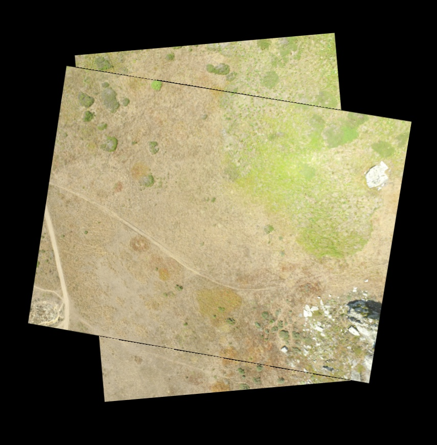

## Synopsis
The task given by DroneDeploy was to generate the first round of tools for stitching a series of images taken from a drone together in a mosaic. The given parameters were the pitch, yaw, and roll of the drone for each photograph as well as the X,Y,Z world coordinates. X and Y are assumed to be in latitude and longitude, and Z was assumed in meters above the ground. Since the camera had a focal length of 20mm the camera intrinsics were ignored in this process. 

## Algorithm and Theory

Using the given pitch, yaw and roll, a 2D rotational transform, using the OpenCV warpAffine, was obtained and performed on the 24 images. The result of which is shown here for the rotation of the first two images in the series.

Following the initial rotation all images must be translated to their appropriate locations within the mosaic. First, features between image pairs were detected using the OpenCV SIFT function and matched using the BruteForceMatcher. The result of the matched points is shown in the following image, which displays the points matched between the first two images in the series.

Clearly, there were some outliers. To detect and remove these, the distance of the lines matched from plane to plane are calculated, and outliers were removed based on deviation from the mean. This was a necessary step to perform prior to the cv2 RANSAC which is allocated in the homogrpahy function. The results of this process are shown in the next three images.

The next step in the process was to use the matched features to generate a homography transform between consecutive image frames. Using this transform images are warped to align with their corresponding features image by image through a projective transformation in the series linearly. Perhaps a more robust implementation of this process would have been to sort the images according to their results from the homography transform for all images in the set and to transform the pairs from the best matching image in the set of 24. For the purposes of this task, the images are iteratively transformed. The resulting image pairs are output to visualize any critical outliers. The results of this output are stored in the 'homography' folder along with the initial set. Two of which are shown here:

From the pairwise homography transforms, it is possible to begin constructing a mosaic of the composite image. This is done iteratively, matching the first image in the set with the next, then the third matched first to the second then to the first, and so on. This process can also be done with the last image, followed by the next to last and so on. The results of the first few images as stiched together and the last few as stiched together are shown in the following images. Unfortunately, through the consecutive transforms the images are warped after progressive transforms. In an attempt to resolve this, the last three images are stiched, followed by the next three. Then the result of this was stiched together as seen in the final image.

TO DO: To make this algorithm more robust, ideally a customized version of RANSAC must be implemented on the matched features to remove the outliers, which could critically affect the transforms in the iterative process. In addition, a matching algorithm should be implemented to optimize the pair of images matched as selected from the set of images. This would be more reliable than the iterative process which works under the assumption that consecutive images in the series have enough features to track and produce a valid homogrpahy transform.

NOTE: ALL CODE WORKS WITH THE OPENCV 3.1.0 LIBRARY!

